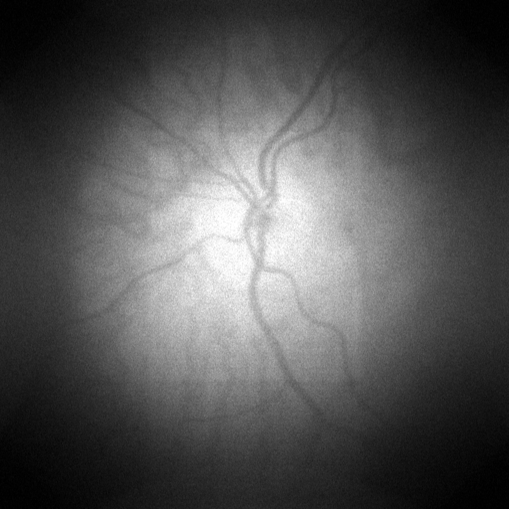
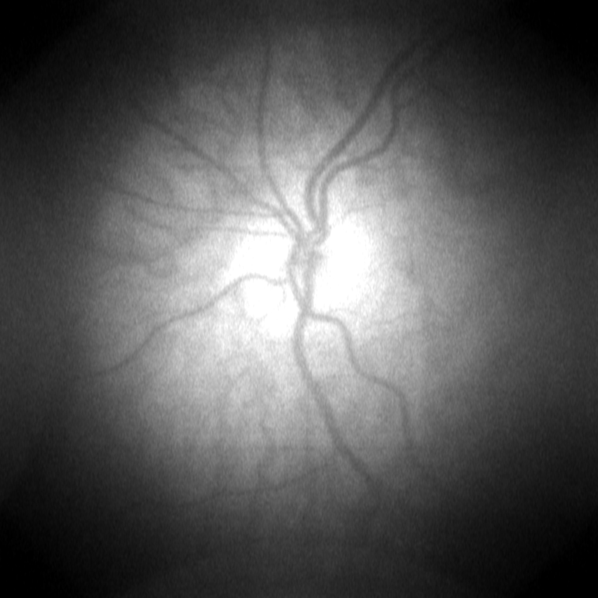
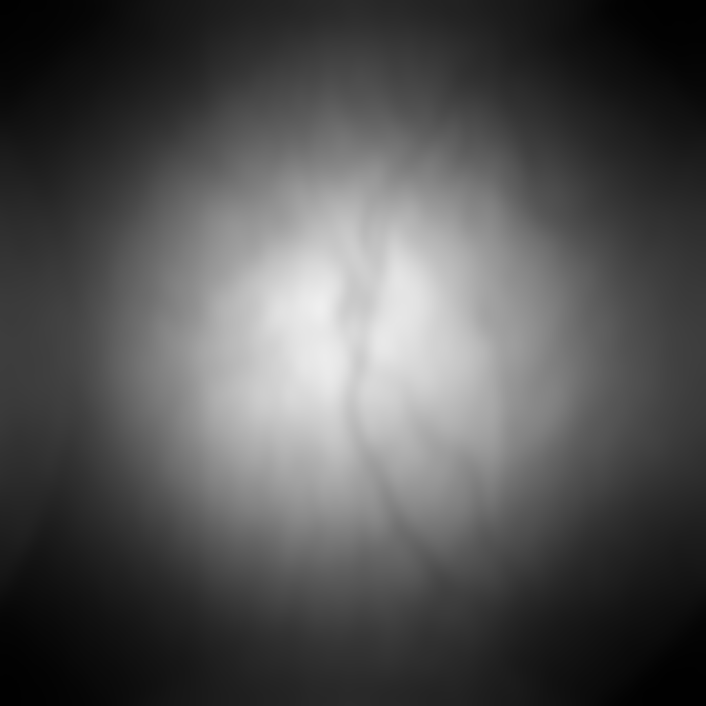
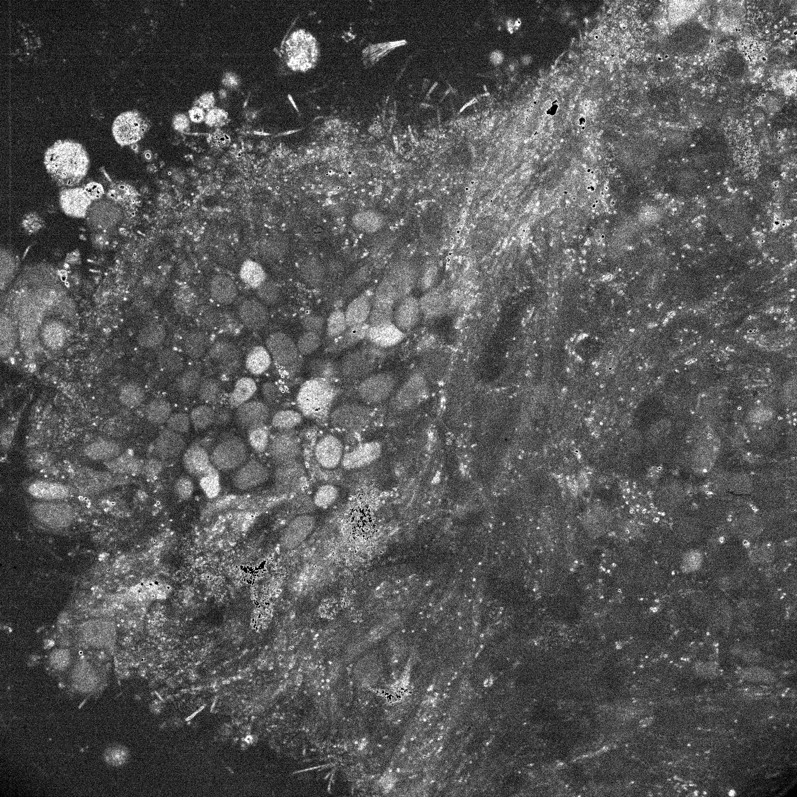

# Post processing 

## Convolution: 
Convolution is the process of adding each element of the image to its local neighbors, weighted by the kernel (or convolution matrix), which is a small matrix.

### Gaussian Kernel
The Gaussian kernel is used as a smoothing operator to blur images, remove detail and high frequencies, that can in result remove noise. The larger the Gaussian kernel size, the more pronounced the blurring effect. However, too large a kernel size can result in a loss of detail.

$$
\frac{1}{273}
\begin{bmatrix}
1 & 4 & 7 & 4 & 1 \\\\
4 & 16 & 26 & 16 & 4 \\\\
7 & 26 & 41 & 26 & 7 \\\\
4 & 16 & 26 & 16 & 4 \\\\
1 & 4 & 7 & 4 & 1 \\\\
\end{bmatrix}
$$
*
5x5 Gaussian Kernel
*

<table>
    <tr>
        <td><b style="font-size:13px">Original Image</b></td>
        <td><b style="font-size:13px">With 4x4 Gaussian convolution</b></td>
        <td><b style="font-size:13px">With 32x32 Gaussian convolution</b></td>
        <td><b style="font-size:13px">With 256x256 Gaussian convolution</b></td>
    </tr>
    <tr>
        <td></td>
        <td></td>
        <td></td>
        <td></td>
    </tr>
</table>

### Sobel Kernel
The Sobel kernel is used for edge detection as it creates an image emphasising the edges. Technically, it is computing an approximation of the gradient of the image intensity function. The Sobel Kernel is in reality two convolution matrix, one for horizontal edges (Sobel X) and the other for vertical edges (Sobel Y)

$$
\begin{bmatrix}
1 & 2 & 0 & -2 & -1 \\\\
4 & 8 & 0 & -8 & -4 \\\\
6 & 12 & 0 & -12 & -6 \\\\
4 & 8 & 0 & -8 & -4 \\\\
1 & 2 & 0 & -2 & -1 \\\\
\end{bmatrix}
$$
*
5x5 Sobel X Kernel
*

<table>
    <tr>
        <td><b style="font-size:13px">Original Image</b></td>
        <td><b style="font-size:13px">With Sobel X convolution TODO</b></td>
        <td><b style="font-size:13px">With Sobel Y convolution TODO</b></td>
    </tr>
    <tr>
        <td></td>
        <td></td>
        <td></td>
    </tr>
</table>

### Divide

<table>
    <tr>
        <td></td>
        <td><b style="font-size:13px">Gaussian 4x4</b></td>
        <td><b style="font-size:13px">Gaussian 32x32</b></td>
        <td><b style="font-size:13px">Gaussian 256x256</b></td>
        <td><b style="font-size:13px">Sobel X TODO</b></td>
        <td><b style="font-size:13px">Sobel Y TODO</b></td>
    </tr>
    <tr>
        <td>Convolution</td>
        <td></td>
        <td></td>
        <td></td>
        <td></td>
        <td></td>
    </tr>
    <tr>
        <td>Convolution + Divide</td>
        <td></td>
        <td></td>
        <td></td>
        <td></td>
        <td></td>
    </tr>
</table>

### Additional Kernels
Holovibes supports the addition of new convolution kernels. To do this, simply add your kernel in txt format to the folder: "Program Files/Holovibes/$HOLOVIBES VERSION/convolution_kernels/".  
 However, the kernel must have a certain format to be supported:  

    "[x] [y] [z];  
    [data]"  

Example with a 3x3 Gaussian kernel:  

    "3 3 1;  
    0.075 0.124 0.075  
    0.124 0.204 0.124  
    0.075 0.124 0.075"  

## Normalization:
The normalization is used in order to change the range of pixel intensity values.

<table>
    <tr>
        <td><b style="font-size:15px">Without normalization</b></td>
        <td><b style="font-size:15px">With normalization</b></td>
    </tr>
    <tr>
        <td></td>
        <td></td>
    </tr>
</table>

## Constrast
TODO(Oscar Morand)
## FFT Shift
TODO(Oscar Morand)
## Logarithmic values
TODO(Oscar Morand)