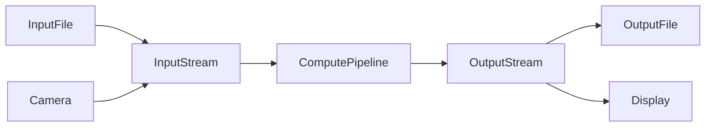
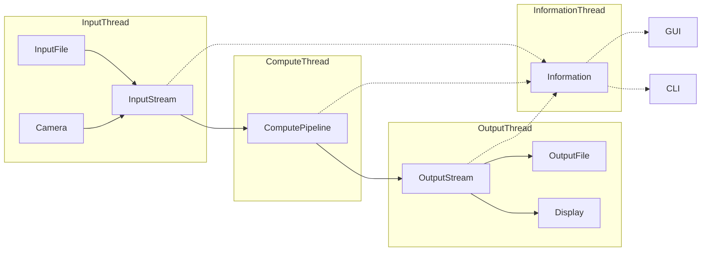
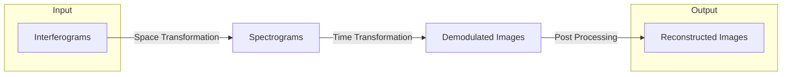
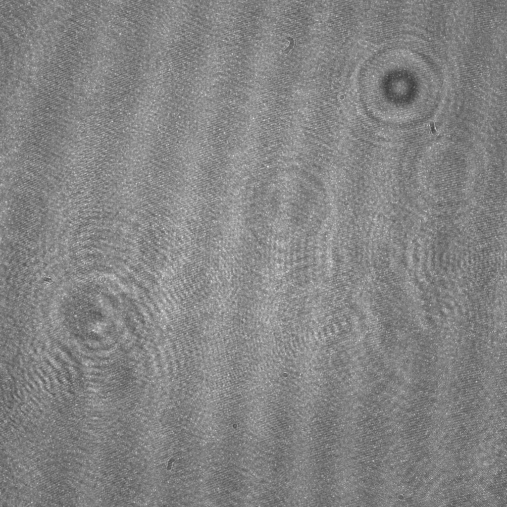
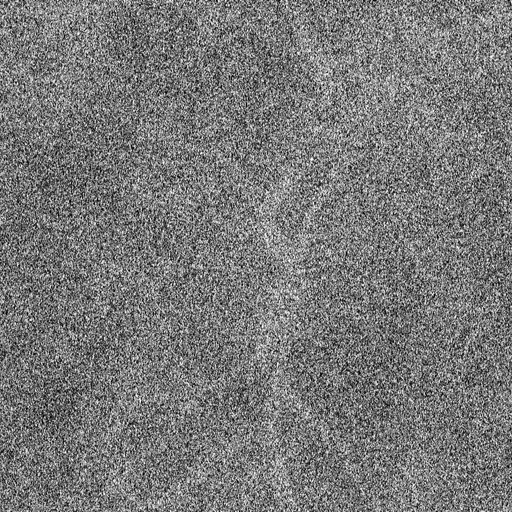

# Software Architecture

The Holovibes software is separated in three sections:
- GUI (Graphical User Interface)
- CLI (Command Line Interface)
- Holovibes-Lib (The core of the project)

# Holovibes-Lib
The workflow of holovibes is simple: 
1. Read bunch of images (from a camera or a file).
2. Process them.
3. Write them (to a display or a file).

## The Four Threads
Each one of those task is run on parallel. While the image processing task is the most compute intensive,
reading and writing files takes some time (Input-Output bonds operations) in particular on slow disk.
By running each task on a thead, we can utilize the CPU and GPU at 100% without having to wait for reading and writing.

- InputThread: Reads real input data from a file or a camera and writes it to the `InputStream`.
- ComputeThread: Reads input data from the `InputStream`, processes it and writes it to the `OutputStream`.
- OutputThread: Reads processed data from the `OutputStream` and writes it to a file or displays it.
- InformationThread: Collects information from the other threads. Used by the `GUI` or `CLI` to display information about the current state of the program, frames per second, etc.

## Compute Pipeline

*An exemple of the image after each step.*

<table>
    <tr>
        <td><b style="font-size:15px">Interferogram</b></td>
        <td><b style="font-size:15px">Spectrogram</b></td>
        <td><b style="font-size:15px">Demodulated Image</b></td>
        <td><b style="font-size:15px">Reconstructed Image</b></td>
    </tr>
    <tr>
        <td></td>
        <td></td>
        <td></td>
        <td></td>
    </tr>
</table>