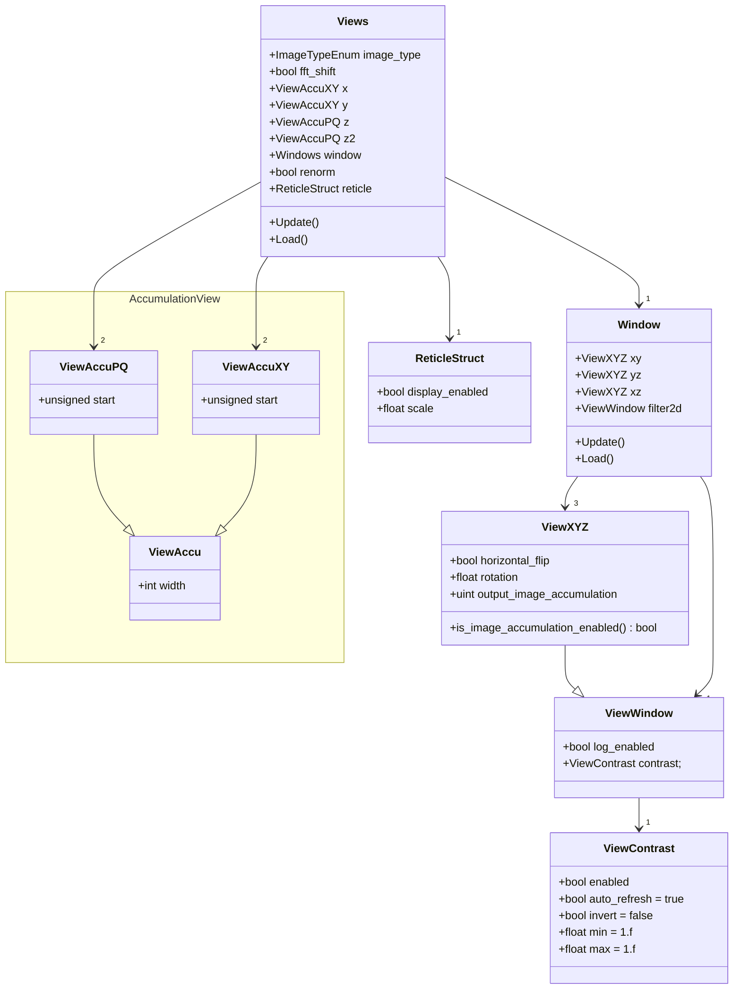

# View Cache

### Window Kind Enum

```cpp
WindowKind {  
    ViewXY = 0,   /* Main view */  
    ViewXZ,       /* view slice */  
    ViewYZ,       /* YZ view slice */  
    ViewFilter2D, /* ViewFilter2D view */  
}
```

### View Struct Diagram

Note : All the structs also override the operators: != (inequality) and << (stream insertion), they also provide a call to the macro SERIALIZE_JSON_STRUCT for serialization

